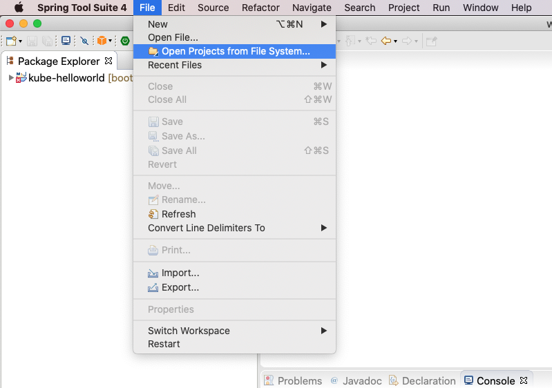
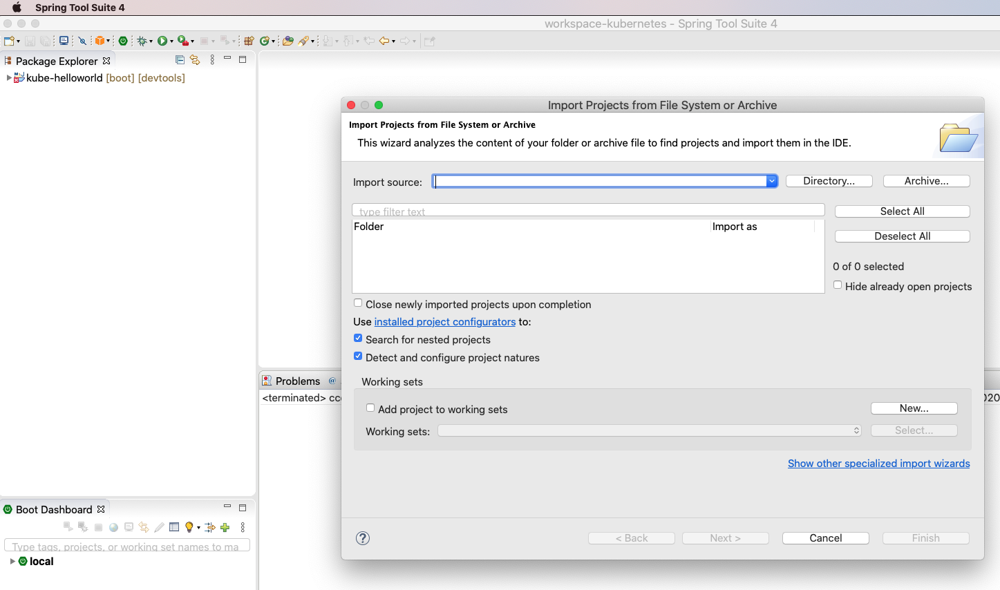
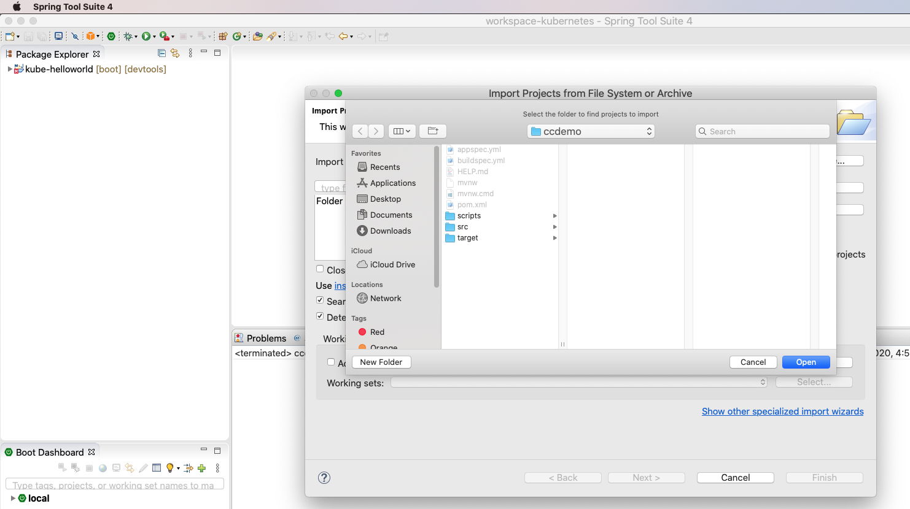
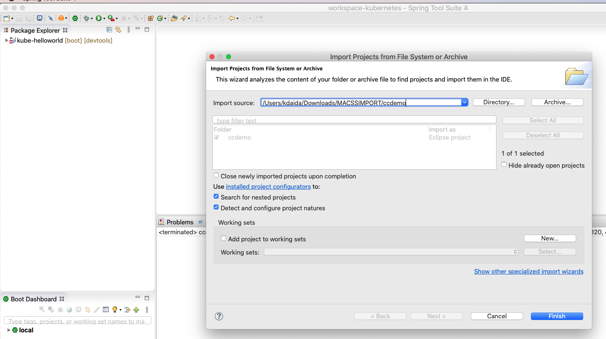
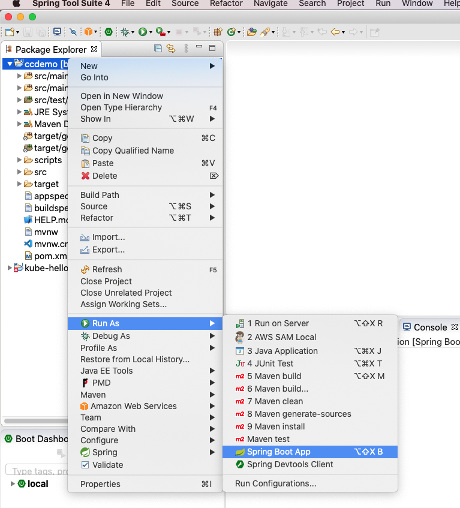
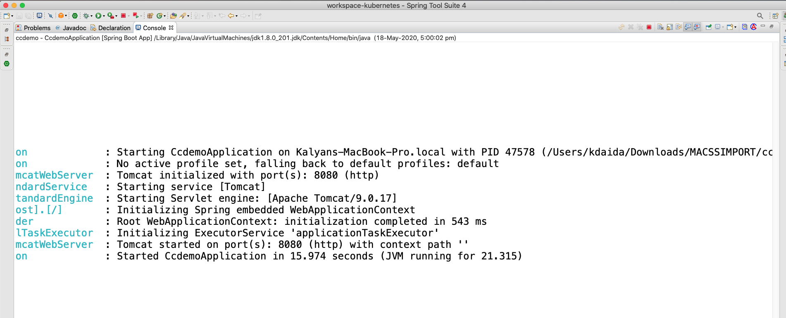
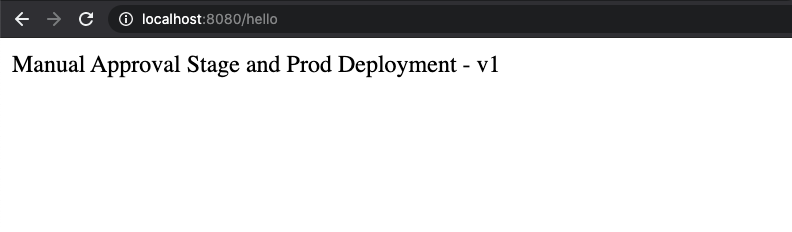

 # Import ccdemo Application (MacOs)

 ## Step-01: Go to URL and click on download
 - Download the `ccdemo.zip` using below link
 - https://github.com/stacksimplify/aws-cloudformation-simplified/blob/master/14-Continuous-Delivery/14-00-Other-Files/SpringBoot-Rest-Service-Application/ccdemo.zip

 ## Step-02: Unzip the Files "ccdemo.zip"
- Create a temp folder, copy `ccdemo.zip` to `temp` folder and unzip it
```
cd /Users/<user>/Downloads
mkdir MACSSIMPORT
mv ccdemo.zip temp
cd temp
unzip ccdemo.zip
```

 ## Step-03: Java version should be 1.8
- Please ensure you are using the Java JDK version is 1.8.x
```
 Kalyans-MacBook-Pro:09-Deployments-with-YAML kdaida$ java -version
Unable to find a $JAVA_HOME at "/usr", continuing with system-provided Java...
java version "1.8.0_201"
Java(TM) SE Runtime Environment (build 1.8.0_201-b09)
Java HotSpot(TM) 64-Bit Server VM (build 25.201-b09, mixed mode)
Kalyans-MacBook-Pro:09-Deployments-with-YAML kdaida$ 
```

## Step-04: Open the Spring Tool Suite IDE
- Click on File --> Open Projects from File System
  - 

- Click on **Directory** and navigate till project home folder and click on Open
```
/Users/<user>/Downloads/MACSSIMPORT/ccdemo
```
  - 
  - 

- Click on Finish (Refer below image)
  - 

- Wait for 3 to 5 minutes, till all the project dependencies got loaded

- Right click on project --> Run As --> Spring Boot App
  -   

- Verify the logs in console  
  -     

- Access the REST API using browser  
```
http://localhost:8080/hello
```
  -       
